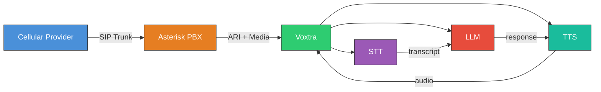

# Voxtra

**Open voice infrastructure for AI agents.**

Built by [Rexplore Research Labs](https://github.com/rexplore-ai)


Voxtra is a Python framework that bridges telephony infrastructure (Asterisk, FreeSWITCH, LiveKit) with AI voice agents (STT, LLM, TTS). It lets developers build AI-powered call centers without needing to understand telecom internals.

## Architecture



### Layer Design

| Layer | Package | Responsibility |
|-------|---------|---------------|
| **Core** | `voxtra.app`, `voxtra.router`, `voxtra.session` | App lifecycle, decorator-based routing, call sessions with `say` / `listen` / `agent` |
| **Telephony** | `voxtra.telephony`, `voxtra.ari` | `BaseTelephonyAdapter` ABC; `AsteriskAdapter` wraps the async `ARIClient` |
| **Audio** | `voxtra.audio` | `AudioSocketServer` — TCP audio I/O with Asterisk; μ-law / A-law / PCM codec helpers |
| **Media** | `voxtra.media` | `AudioFrame` + `BaseMediaTransport`; `CallSessionMediaTransport` bridges sessions into the pipeline |
| **AI** | `voxtra.ai` | STT, TTS, LLM, VAD provider abstractions; `Registry` plugin system |
| **Pipeline** | `voxtra.core.pipeline` | Real-time STT → LLM → TTS orchestration; auto-wired per session when providers configured |
| **Provisioning** | `voxtra.provisioning` | Per-tenant Asterisk pjsip / dialplan generation (optional, `voxtra[provisioning]`) |

## Quick Start

### Installation

**From PyPI:**

```bash
pip install voxtra
```

With provider extras (Asterisk is part of the core install — no extra needed):

```bash
pip install "voxtra[deepgram,openai,elevenlabs,cartesia]"
# or grab everything in one go
pip install "voxtra[all]"
```

Available extras: `deepgram`, `openai`, `elevenlabs`, `cartesia`, `livekit`, `provisioning`, `all`, `dev`.

**From GitHub (latest development version):**

```bash
pip install git+https://github.com/rexplore-ai/voxtra.git
```

**From source (for development):**

```bash
git clone https://github.com/rexplore-ai/voxtra.git
cd voxtra
python3 -m venv .venv && source .venv/bin/activate
pip install -e ".[dev]"
```

### Code-First Usage

```python
from voxtra import VoxtraApp

app = VoxtraApp.from_yaml("voxtra.yaml")

@app.route(extension="1000")
async def support_call(session):
    await session.answer()
    await session.say("Hello, welcome to support. How can I help you?")
    text = await session.listen()
    reply = await session.agent.respond(text)
    await session.say(reply.text)
    await session.hangup()

app.run()
```

### Config-First Usage

Create `voxtra.yaml`:

```yaml
app_name: my-call-center

telephony:
  provider: asterisk
  asterisk:
    base_url: http://localhost:8088
    username: asterisk
    password: secret
    app_name: voxtra

media:
  transport: websocket
  codec: ulaw
  sample_rate: 8000

ai:
  stt:
    provider: deepgram
    api_key: ${DEEPGRAM_API_KEY}
    model: nova-2
  llm:
    provider: openai
    api_key: ${OPENAI_API_KEY}
    model: gpt-4o
    system_prompt: "You are a helpful voice assistant for a call center."
  tts:
    provider: elevenlabs
    api_key: ${ELEVENLABS_API_KEY}
    voice_id: your-voice-id

routes:
  - extension: "1000"
    agent: support_agent
```

Then run:

```bash
voxtra start
```

## Asterisk Integration

Voxtra connects to Asterisk on two channels:

- **ARI (Asterisk REST Interface)** — control plane. HTTP for call operations, WebSocket for events.
- **AudioSocket** — media plane. A simple framed TCP protocol (1-byte type + 3-byte length + payload). Voxtra's `AudioSocketServer` accepts the connection Asterisk opens; no RTP/NAT/SDP to worry about.

Add this to your dialplan to route inbound calls into the Voxtra Stasis app:

```ini
[voxtra-inbound]
exten => _X.,1,Stasis(voxtra)
 same => n,Hangup()
```

Voxtra opens AudioSocket connections on demand the first time a handler calls `session.audio_stream()`, `session.say()`, `session.listen()`, or any other audio I/O.

## Supported Providers

### Telephony
- **Asterisk** (ARI) — Production ready
- **LiveKit** (SIP) — Planned
- **FreeSWITCH** — Planned

### Speech-to-Text
- **Deepgram** (streaming)
- More coming soon

### LLM / Agents
- **OpenAI** (GPT-4o, streaming)
- LangGraph integration planned

### Text-to-Speech
- **ElevenLabs** (streaming)
- **Cartesia** (streaming)
- More coming soon

## Project Structure

```
src/voxtra/
├── app.py                       # VoxtraApp — entry point, lifecycle, from_yaml/from_config
├── session.py                   # CallSession + AgentClient (say/listen/agent)
├── router.py                    # Decorator-based call routing
├── registry.py                  # Provider plugin registry (STT/TTS/LLM/VAD/telephony/media)
├── events.py                    # VoxtraEvent + typed subclasses
├── config.py                    # Pydantic config models + VoxtraConfig.from_yaml
├── middleware.py                # Event middleware
├── exceptions.py                # Custom exceptions
├── types.py                     # AudioChunk, CallState, AudioCodec, SIPTrunk, …
├── cli.py                       # `voxtra` CLI: start, init, info, check
├── ari/                         # Asterisk ARI client
│   ├── client.py                #   async HTTP + WebSocket client
│   ├── events.py                #   ARIEvent typed model
│   └── models.py                #   Channel / Bridge / Playback Pydantic models
├── audio/                       # AudioSocket — TCP audio I/O with Asterisk
│   ├── socket.py                #   AudioSocketServer + AudioSocketConnection
│   └── codec.py                 #   μ-law / A-law / PCM-S16LE conversion
├── telephony/                   # Backend abstraction
│   ├── base.py                  #   BaseTelephonyAdapter ABC
│   ├── asterisk/adapter.py      #   AsteriskAdapter (wraps ARIClient)
│   └── livekit/                 #   LiveKit adapter (stub)
├── media/                       # Frame-oriented media stack used by VoicePipeline
│   ├── audio.py                 #   AudioFrame + codec helpers
│   ├── base.py                  #   BaseMediaTransport ABC
│   ├── websocket.py             #   WebSocket transport
│   ├── buffer.py                #   Audio buffering
│   └── session_transport.py     #   Bridges CallSession ↔ BaseMediaTransport
├── core/
│   └── pipeline.py              # VoicePipeline — STT → LLM → TTS orchestration
├── provisioning/                # Per-tenant Asterisk config generation (optional)
│   └── provisioner.py           #   pjsip / extensions / ari fragment writer
└── ai/
    ├── stt/                     # Speech-to-Text providers (Deepgram, …)
    ├── tts/                     # Text-to-Speech providers (ElevenLabs, Cartesia, …)
    ├── llm/                     # LLM / Agent providers (OpenAI, …)
    └── vad/                     # Voice Activity Detection
```

## Documentation

- **[Architecture](docs/architecture.md)** — Deep-dive into every layer, component, data flow, and design decision
- **[Contributing](CONTRIBUTING.md)** — How to set up dev environment, add providers, submit PRs, and code standards

## Development

```bash
git clone git@github.com:rexplore-ai/voxtra.git
cd voxtra
python3 -m venv .venv && source .venv/bin/activate
pip install -e ".[dev]"
pytest
```

## Roadmap

Shipped in **0.3.0**:

- [x] Core abstractions (VoxtraApp, Router, CallSession, Events)
- [x] Asterisk ARI adapter (wraps async `ARIClient`, conforms to `BaseTelephonyAdapter`)
- [x] AudioSocket TCP transport + μ-law / A-law / PCM codec helpers
- [x] AI provider interfaces (STT, TTS, LLM, VAD) + `Registry` plugin system
- [x] Voice pipeline (STT → LLM → TTS), **auto-wired per session** when providers configured
- [x] High-level session API: `say(text)`, `listen(timeout=)`, `agent.respond(text)`
- [x] `VoxtraApp.from_yaml(path)` / `from_config(VoxtraConfig)` + working `voxtra start` CLI
- [x] WebSocket media transport
- [x] Per-tenant Asterisk provisioning (config file generation)

Planned:

- [ ] End-to-end Asterisk + AI demo with recordings
- [ ] LiveKit adapter (currently a stub)
- [ ] FreeSWITCH adapter
- [ ] HMAC-signed backend webhook emitter
- [ ] Recording sinks (GCS / S3) — auto-upload after `record_stop()`
- [ ] Multi-tenant runtime supervisor (one ARI app per tenant)
- [ ] Provisioner stage 2: SSH + `asterisk -rx reload`
- [ ] Prometheus metrics ASGI sub-app
- [ ] LangGraph agent integration
- [ ] Multi-agent handoff
- [ ] Dashboard / Admin API
- [ ] Conversation analytics

## Contributors

Thanks to everyone who has contributed to Voxtra!

<a href="https://github.com/byamasu-patrick">
  
</a>

**[Patrick Byamasu](https://github.com/byamasu-patrick)** — Creator & Lead Maintainer

Want to contribute? Check out our [Contributing Guide](CONTRIBUTING.md).

## License

Apache 2.0 — See [LICENSE](LICENSE)

---

**Voxtra** — *The LangGraph of AI Telephony*
Built by Rexplore Research Labs
