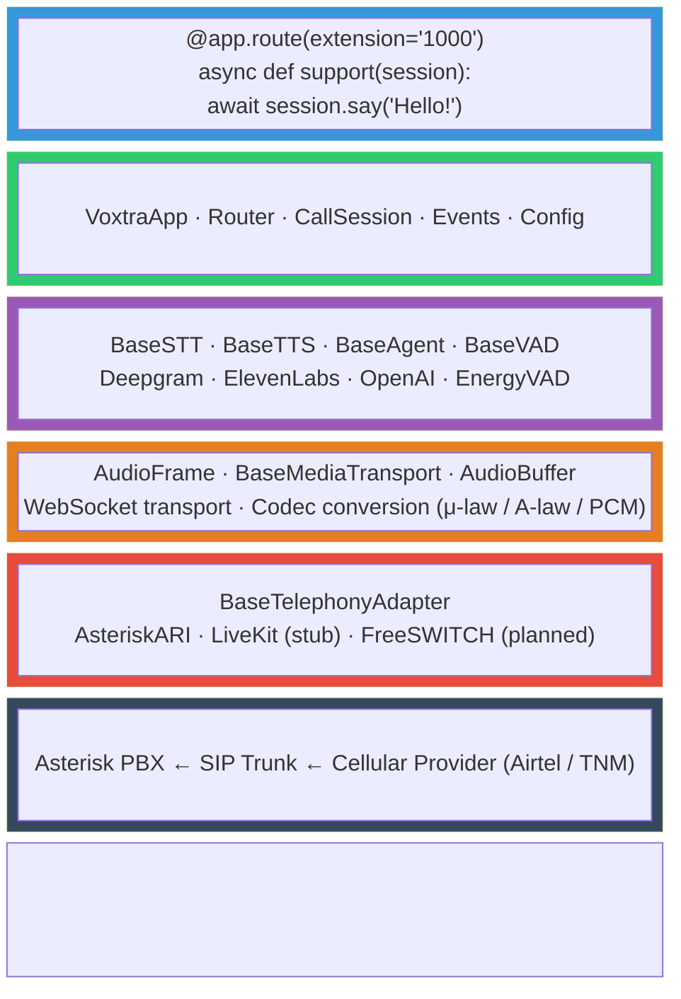
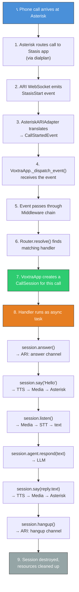
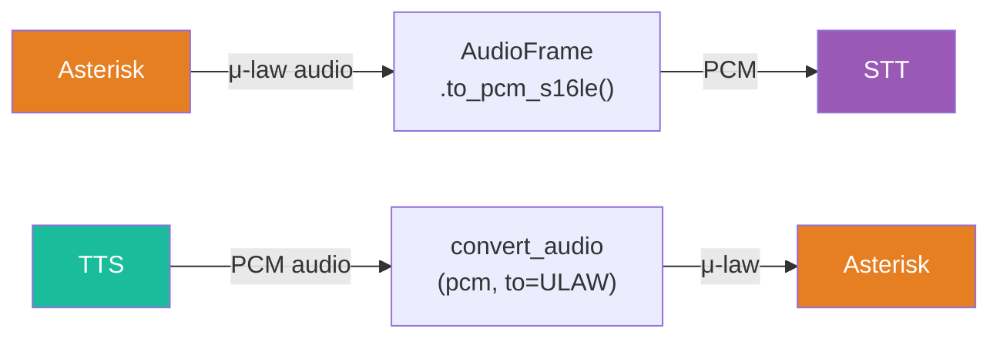
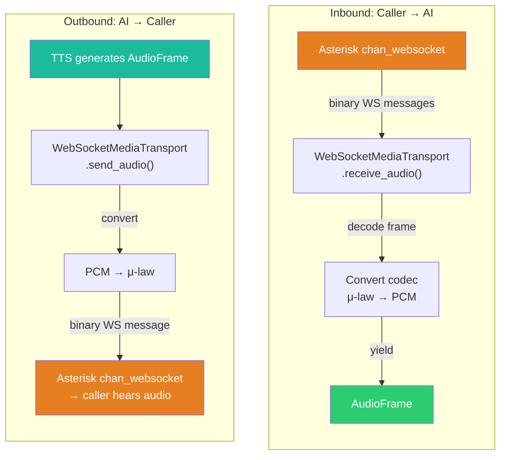
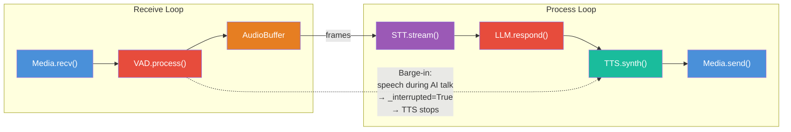
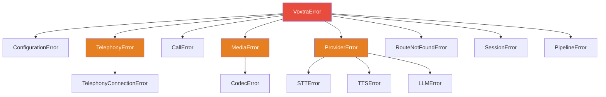

# Voxtra Architecture

> Deep-dive into how Voxtra works — every layer, every component, and how they connect.

---

## Overview

Voxtra is a **4-layer Python framework** that bridges telephony infrastructure with AI voice agents. It follows a plugin architecture where every component — telephony backend, media transport, STT, TTS, LLM, VAD — is abstracted behind interfaces and can be swapped independently.



---

## Call Flow

When a phone call arrives, this is exactly what happens inside Voxtra:



---

## Layer 1 — Core

The core layer provides the application framework, routing, session management, event system, and configuration. This is what developers interact with directly.

### VoxtraApp (`src/voxtra/app.py`)

The main entry point. `VoxtraApp` is the equivalent of a FastAPI `app` or Flask `app` — it wires everything together and manages the application lifecycle.

**Responsibilities:**
- Load configuration (from YAML or programmatic)
- Resolve and instantiate components (telephony, media, AI providers)
- Manage the Router for call dispatch
- Create and destroy CallSessions
- Dispatch events through the middleware chain
- Run startup/shutdown hooks
- Provide the `@app.route()` decorator

**Key methods:**

| Method | What it does |
|--------|-------------|
| `VoxtraApp.from_yaml(path)` | Create app from YAML config file |
| `@app.route(extension=..., number=...)` | Register a call handler |
| `@app.default_route()` | Register a fallback handler |
| `app.add_middleware(mw)` | Add event middleware |
| `app.on_startup(func)` | Register startup hook |
| `app.run()` | Start the application (blocking) |
| `app.start()` | Start the application (async) |
| `app.stop()` | Graceful shutdown |

**Component resolution:**

When `app.start()` is called, VoxtraApp resolves all components from config:

```
config.telephony.provider == "asterisk"
    → AsteriskARIAdapter(config.telephony.asterisk)

config.ai.stt.provider == "deepgram"
    → DeepgramSTT(config.ai.stt)

config.ai.tts.provider == "elevenlabs"
    → ElevenLabsTTS(config.ai.tts)

config.ai.llm.provider == "openai"
    → OpenAIAgent(config.ai.llm)
```

Components can also be injected directly for testing or custom setups:

```python
app = VoxtraApp(
    config=config,
    telephony=my_custom_adapter,
    stt=my_custom_stt,
)
```

---

### Router (`src/voxtra/router.py`)

The Router maps incoming calls to handler functions. Inspired by FastAPI's decorator-based routing.

**Three resolution strategies (evaluated in order):**

1. **Dynamic dispatch rules** — Async functions that receive call metadata and return a handler (or `None` to skip). Evaluated in registration order; first non-None result wins.

2. **Static routes** — Extension or phone number matching via the `@router.route()` decorator. Supports exact matching and wildcard prefix matching (e.g., `"+265*"`).

3. **Default handler** — Fallback registered via `@router.default()`.

**Example:**

```python
# Static route by extension
@app.route(extension="1000")
async def support(session): ...

# Static route by number with wildcard
@app.route(number="+265*")
async def malawi_calls(session): ...

# Dynamic dispatch rule
async def language_dispatch(call_info):
    if call_info.get("language") == "chichewa":
        return chichewa_handler
    return None

app.router.add_dispatch_rule(language_dispatch)

# Default fallback
@app.default_route()
async def fallback(session): ...
```

**Key classes:**

| Class | Purpose |
|-------|---------|
| `Route` | A single routing rule (handler + match criteria) |
| `Router` | Collection of routes + resolution logic |

---

### CallSession (`src/voxtra/session.py`)

The developer-facing handle for an active call. Every inbound or outbound call gets its own `CallSession`, which provides a clean async API for voice interaction.

**This is the most important class for developers.** Everything they need is on the session:

| Method | What it does |
|--------|-------------|
| `session.answer()` | Answer the ringing call |
| `session.say(text)` | Synthesize text and play to caller (TTS → Media) |
| `session.listen(timeout)` | Listen for caller speech and return transcript (Media → STT) |
| `session.stream()` | Yield raw events as an async iterator |
| `session.transfer(target)` | Transfer call to another extension |
| `session.hangup()` | Hang up the call |
| `session.hold()` | Place call on hold |
| `session.play_audio(data)` | Play raw audio bytes |
| `session.send_dtmf(digits)` | Send DTMF tones |
| `session.set_context(k, v)` | Store call metadata |
| `session.get_context(k)` | Retrieve call metadata |
| `session.agent` | Access the LLM agent (`.respond()`, `.respond_stream()`) |
| `session.history` | Get conversation history |

**Internal architecture:**

```
CallSession
├── _telephony: BaseTelephonyAdapter  (call control)
├── _media: BaseMediaTransport        (audio I/O)
├── _stt: BaseSTT                     (speech → text)
├── _tts: BaseTTS                     (text → speech)
├── _agent: BaseAgent                 (LLM reasoning)
├── _event_queue: asyncio.Queue       (event stream)
└── _conversation_history: list       (chat messages)
```

The session's `say()` method chains TTS → Media:

```
session.say("Hello")
    │
    ▼
self._tts.synthesize("Hello")
    → yields AudioFrame objects
    │
    ▼
self._media.send_audio(frame)
    → sends audio to the caller via WebSocket/RTP
```

The session's `listen()` method waits for a `USER_TRANSCRIPT` event:

```
session.listen(timeout=30)
    │
    ▼
Waits on self._event_queue for EventType.USER_TRANSCRIPT
    │
    ▼
Returns the transcribed text
```

---

### Events (`src/voxtra/events.py`)

Events are the internal communication mechanism. Every significant thing that happens in a call emits an event.

**Event categories:**

| Category | Events |
|----------|--------|
| **Call lifecycle** | `call.started`, `call.ringing`, `call.answered`, `call.ended`, `call.failed`, `call.transferred` |
| **Media** | `media.started`, `media.stopped`, `audio.frame.received`, `audio.frame.sent` |
| **AI pipeline** | `user.speech.started`, `user.speech.ended`, `user.transcript`, `user.transcript.partial`, `agent.thinking`, `agent.response`, `agent.speech.started`, `agent.speech.ended` |
| **Control** | `dtmf.received`, `barge_in`, `silence.detected`, `turn.ended` |
| **System** | `error`, `session.created`, `session.destroyed` |

**Event model:**

Every event carries:
- `id` — Unique event identifier
- `type` — EventType enum value
- `session_id` — Links the event to a call
- `timestamp` — When it occurred (UTC)
- `data` — Arbitrary payload dict

**Specialized event classes:**

| Class | Extra fields |
|-------|-------------|
| `CallStartedEvent` | `caller_id`, `callee_id`, `direction` |
| `CallEndedEvent` | `reason`, `duration_seconds` |
| `UserTranscriptEvent` | `text`, `confidence`, `is_final` |
| `AgentResponseEvent` | `text`, `tool_calls` |
| `DTMFEvent` | `digit` |
| `ErrorEvent` | `error_type`, `message` |

---

### Middleware (`src/voxtra/middleware.py`)

Middleware intercepts events before they reach handlers. Similar to ASGI middleware in web frameworks.

```
Event arrives
    → Middleware 1 (e.g., LoggingMiddleware)
        → Middleware 2 (e.g., ErrorHandlingMiddleware)
            → Final handler (router dispatch)
```

**Built-in middleware:**
- `LoggingMiddleware` — Logs all events
- `ErrorHandlingMiddleware` — Catches and logs exceptions

**Custom middleware:**

```python
from voxtra.middleware import BaseMiddleware

class MetricsMiddleware(BaseMiddleware):
    async def process(self, event, next_handler):
        start = time.time()
        result = await next_handler(event)
        duration = time.time() - start
        record_metric(event.type, duration)
        return result

app.add_middleware(MetricsMiddleware())
```

---

### Config (`src/voxtra/config.py`)

All configuration is modeled with Pydantic v2, supporting both programmatic construction and YAML file loading.

**Config hierarchy:**

```
VoxtraConfig
├── app_name: str
├── version: str
├── server: ServerConfig
│   ├── host: str
│   ├── port: int
│   └── debug: bool
├── telephony: TelephonyConfig
│   ├── provider: str ("asterisk" | "livekit")
│   ├── asterisk: AsteriskConfig
│   │   ├── base_url, username, password, app_name
│   │   └── websocket_url (auto-derived)
│   ├── livekit: LiveKitConfig
│   │   ├── url, api_key, api_secret
│   └── sip_trunks: list[SIPTrunkConfig]
├── media: MediaConfig
│   ├── transport: "websocket" | "rtp"
│   ├── codec: "ulaw" | "alaw" | "pcm_s16le"
│   ├── sample_rate: int (default 8000)
│   ├── channels: int (default 1)
│   └── frame_duration_ms: int (default 20)
├── ai: AIConfig
│   ├── stt: STTConfig
│   │   ├── provider, api_key, model, language
│   │   └── interim_results, punctuate
│   ├── tts: TTSConfig
│   │   ├── provider, api_key, voice_id, model
│   │   └── sample_rate
│   ├── llm: LLMConfig
│   │   ├── provider, api_key, model
│   │   ├── temperature, max_tokens
│   │   └── system_prompt
│   └── vad: VADConfig
│       ├── enabled, silence_threshold_ms
│       └── speech_threshold_ms, energy_threshold
└── routes: list[RouteConfig]
    ├── extension, number
    ├── agent, handler
    └── metadata
```

**Loading:**

```python
# From YAML
config = VoxtraConfig.from_yaml("voxtra.yaml")

# Programmatic
config = VoxtraConfig(
    app_name="my-app",
    telephony=TelephonyConfig(provider="asterisk", ...),
)

# Roundtrip
config.to_yaml("output.yaml")
```

---

## Layer 2 — AI Providers

The AI layer defines abstract interfaces for all AI components. Each interface is an ABC (Abstract Base Class) that providers must implement.

### BaseSTT (`src/voxtra/ai/stt/base.py`)

Speech-to-Text — converts caller audio into text.

**Interface:**

```
connect()               → Initialize SDK client
transcribe_stream(iter) → Async iterator: AudioFrame → TranscriptionResult
transcribe(bytes)       → Batch: audio bytes → TranscriptionResult
disconnect()            → Clean up
```

**TranscriptionResult fields:** `text`, `confidence`, `is_final`, `language`, `words`, `duration_seconds`

**Implementations:**
- `DeepgramSTT` — Streaming via Deepgram's WebSocket API, supports interim results

**Critical for telephony:**
- Must support **streaming** (frame-by-frame) for real-time transcription
- Must handle **interim results** for low-latency turn detection
- Telephony audio is 8kHz mono μ-law — STT must accept this format

---

### BaseTTS (`src/voxtra/ai/tts/base.py`)

Text-to-Speech — converts agent responses into audio.

**Interface:**

```
connect()               → Initialize SDK client
synthesize(text)        → Async iterator: text → AudioFrame chunks
synthesize_full(text)   → Batch: text → complete audio bytes
disconnect()            → Clean up
```

**Implementations:**
- `ElevenLabsTTS` — Streaming via ElevenLabs API, yields audio chunks as generated

**Critical for telephony:**
- Must support **streaming synthesis** — yield audio chunks as they're generated, don't wait for the full utterance
- Output must be convertible to telephony codecs (8kHz μ-law)
- Low latency is essential — target < 300ms time-to-first-byte

---

### BaseAgent (`src/voxtra/ai/llm/base.py`)

LLM Agent — the reasoning engine that processes transcribed speech and generates responses.

**Interface:**

```
connect()                      → Initialize SDK client
respond(text, history, prompt) → Full response: AgentResponse
respond_stream(text, ...)      → Async iterator: yields text chunks
disconnect()                   → Clean up
reset_history()                → Clear conversation memory
add_to_history(role, content)  → Append message
```

**AgentResponse fields:** `text`, `tool_calls`, `finish_reason`, `usage`

**Implementations:**
- `OpenAIAgent` — GPT-4o via the OpenAI Python SDK, supports streaming

**Design note:**
- The agent maintains **conversation history** internally
- `respond_stream()` enables sentence-level TTS — the pipeline can start synthesizing before the full LLM response is complete
- System prompts should be optimized for **voice conversations** (concise, conversational tone)

---

### BaseVAD (`src/voxtra/ai/vad/base.py`)

Voice Activity Detection — determines when the caller starts and stops speaking.

**Interface:**

```
process_frame(frame) → VADResult (state, confidence, durations)
reset()              → Reset state for new utterance
is_speaking()        → bool
```

**VADState:** `SILENCE`, `SPEECH`, `UNCERTAIN`

**Implementations:**
- `EnergyVAD` — Simple RMS energy-based detection with configurable thresholds

**Why VAD matters for telephony AI:**
- **Turn detection** — Know when the caller finished speaking so the agent can respond
- **Barge-in** — Detect when the caller interrupts the AI's speech and stop TTS immediately
- **Silence timeout** — End the call or re-prompt after extended silence

---

## Layer 3 — Media

The media layer handles real-time bidirectional audio streaming between the telephony infrastructure and the AI pipeline.

### AudioFrame (`src/voxtra/media/audio.py`)

The universal audio container in Voxtra. All components communicate using `AudioFrame` objects.

**Fields:**

| Field | Type | Default | Description |
|-------|------|---------|-------------|
| `data` | `bytes` | `b""` | Raw audio bytes |
| `sample_rate` | `int` | `8000` | Sample rate in Hz |
| `channels` | `int` | `1` | Number of channels (mono) |
| `codec` | `AudioCodec` | `PCM_S16LE` | Audio codec |
| `timestamp_ms` | `float` | `0.0` | Timestamp relative to stream start |
| `duration_ms` | `float` | `20.0` | Frame duration |
| `sequence` | `int` | `0` | Sequence number for ordering |

**Codec conversion:**

Telephony uses μ-law (G.711) at 8kHz. AI providers typically need PCM or specific formats.



Supported conversions:
- `ULAW ↔ PCM_S16LE`
- `ALAW ↔ PCM_S16LE`

The codec conversion is done in pure Python using ITU-T G.711 lookup tables. For production at scale, this could be replaced with a C extension.

**SilenceFrame** — A convenience class that generates silence audio (all zeros). Used for padding, hold audio, and silence insertion.

---

### BaseMediaTransport (`src/voxtra/media/base.py`)

Abstract interface for bidirectional audio streaming.

**Interface:**

```
connect(endpoint)    → Open the transport connection
receive_audio()      → Async iterator: yields AudioFrame from caller
send_audio(frame)    → Send AudioFrame to caller
disconnect()         → Close the connection
```

**Implementations:**
- `WebSocketMediaTransport` — Connects via WebSocket (recommended for Asterisk's `chan_websocket`)

**WebSocket transport flow:**



---

### AudioBuffer (`src/voxtra/media/buffer.py`)

Async thread-safe buffer for audio frames. Smooths jitter and accumulates frames for batch processing.

**Features:**
- Async push/drain with `asyncio.Event` signaling
- Configurable max buffer duration (prevents unbounded growth)
- Configurable minimum drain threshold
- Evicts oldest frames when buffer overflows
- Stream interface for continuous consumption

---

## Layer 4 — Telephony

The telephony layer connects Voxtra to PBX systems and telephony infrastructure.

### BaseTelephonyAdapter (`src/voxtra/telephony/base.py`)

Abstract interface that all telephony backends must implement.

**Interface:**

| Method | Purpose |
|--------|---------|
| `connect()` | Connect to the PBX |
| `disconnect()` | Disconnect |
| `listen(callback)` | Listen for events, translate to VoxtraEvents, call callback |
| `answer_call(channel_id)` | Answer a ringing call |
| `hangup_call(channel_id)` | Hang up a call |
| `transfer_call(channel_id, target)` | Transfer to another destination |
| `hold_call(channel_id)` | Place on hold |
| `send_dtmf(channel_id, digits)` | Send DTMF tones |
| `create_media_bridge(channel_id)` | Set up audio streaming bridge |
| `play_audio(channel_id, uri)` | Play audio file/URI |

---

### AsteriskARIAdapter (`src/voxtra/telephony/asterisk/adapter.py`)

Full implementation connecting to Asterisk via the **Asterisk REST Interface (ARI)**.

**Two connections:**

1. **HTTP REST API** (`httpx.AsyncClient`) — For call control operations (answer, hangup, transfer, bridge creation, DTMF, play audio)

2. **WebSocket** (`websockets`) — For real-time event streaming (StasisStart, StasisEnd, DTMF, Hangup)

**Event translation:**

| ARI Event | Voxtra Event |
|-----------|-------------|
| `StasisStart` | `CallStartedEvent` (caller_id, callee_id, direction) |
| `StasisEnd` | `CallEndedEvent` (reason) |
| `ChannelDtmfReceived` | `DTMFEvent` (digit) |
| `ChannelHangupRequest` | `CallEndedEvent` (reason) |
| `ChannelDestroyed` | `CallEndedEvent` (reason) |

**Media bridging:**

The adapter's `create_media_bridge()` method sets up:
1. A **mixing bridge** in Asterisk
2. An **external media channel** pointing to the Voxtra media server
3. Adds both the call channel and external media channel to the bridge

This routes call audio through Voxtra for AI processing.

**Asterisk dialplan requirement:**

```ini
[voxtra-inbound]
exten => _X.,1,Stasis(voxtra)
 same => n,Hangup()
```

This tells Asterisk to send all calls in this context to the Voxtra Stasis app.

---

### LiveKitAdapter (`src/voxtra/telephony/livekit/adapter.py`)

**Status: Stub (Phase 2)**

LiveKit provides WebRTC-based real-time communication with native SIP telephony support. The adapter will bridge LiveKit rooms with Voxtra's AI pipeline.

When implemented, it will use:
- LiveKit's SIP trunk management APIs
- LiveKit's dispatch rules for call routing
- LiveKit rooms for media streaming
- Python `livekit-agents` SDK

---

## Voice Pipeline (`src/voxtra/core/pipeline.py`)

The `VoicePipeline` is the real-time engine that orchestrates the full AI voice loop.

**Architecture:**



**Two concurrent loops:**

1. **Receive loop** — Reads audio frames from the media transport, runs VAD on each frame, pushes frames into the AudioBuffer. Detects barge-in when the caller speaks while the AI is talking.

2. **Process loop** — Drains the AudioBuffer, streams frames through STT, sends final transcripts to the LLM, synthesizes responses via TTS, and sends audio back to the caller.

**Barge-in handling:**

When VAD detects speech while `_is_speaking` is True:
1. Sets `_interrupted = True`
2. Emits a `BARGE_IN` event
3. The `_speak()` method checks `_interrupted` on each audio frame and stops immediately

---

## CLI (`src/voxtra/cli.py`)

The `voxtra` command-line interface provides quick operations:

| Command | What it does |
|---------|-------------|
| `voxtra start` | Start the app from `voxtra.yaml` (or `-c path`) |
| `voxtra start --debug` | Start with debug logging |
| `voxtra init` | Generate a starter `voxtra.yaml` |
| `voxtra info` | Show version, Python, platform, installed providers |
| `voxtra check` | Validate a config file |
| `voxtra --version` | Print version |

---

## Exception Hierarchy (`src/voxtra/exceptions.py`)

All Voxtra exceptions inherit from `VoxtraError`:



---

## Type System (`src/voxtra/types.py`)

Shared enums and type aliases used across the framework:

| Type | Values |
|------|--------|
| `CallDirection` | `INBOUND`, `OUTBOUND` |
| `CallState` | `RINGING`, `ANSWERED`, `IN_PROGRESS`, `ON_HOLD`, `TRANSFERRING`, `COMPLETED`, `FAILED` |
| `AudioCodec` | `ULAW`, `ALAW`, `PCM_S16LE`, `OPUS` |
| `MediaTransportType` | `WEBSOCKET`, `RTP`, `LIVEKIT` |
| `ProviderType` | `STT`, `TTS`, `LLM`, `VAD` |

---

## Design Principles

### 1. Plugin Architecture
Every component is behind an abstract interface. Swap providers without changing application code.

### 2. Async-First
All I/O is async. The framework uses `asyncio` throughout for real-time performance. This is critical for telephony where latency matters.

### 3. Config-Driven
Applications can be configured entirely via YAML. No code changes needed to switch providers, change models, or update SIP trunk settings.

### 4. Developer Ergonomics
The API is inspired by FastAPI and Flask — decorator-based routing, clean session API, minimal boilerplate. A developer should be able to build a working AI call agent in under 20 lines of code.

### 5. Separation of Concerns
- **Telephony layer** knows nothing about AI
- **AI layer** knows nothing about telephony
- **Media layer** bridges them
- **Core layer** orchestrates everything

### 6. Event-Driven
Everything communicates via events. This enables middleware, logging, analytics, and extensibility without coupling components.

---

## Data Flow Diagram

### Inbound Call: Full Path

```mermaid
flowchart TD
    CN["📡 Cellular Network\n(Airtel / TNM)"] -->|SIP INVITE| STP["SIP Trunk Provider"]
    STP -->|SIP| AST["📞 Asterisk PBX"]
    AST -->|"Stasis(voxtra)"| ARI["AsteriskARIAdapter"]
    ARI -->|CallStartedEvent| DISP["VoxtraApp._dispatch_event()"]
    DISP -->|Middleware chain| ROUTER["Router.resolve()\n→ handler function"]
    ROUTER --> SESSION["CallSession created"]

    SESSION --> ANS["session.answer()\n→ ARI POST /channels/id/answer"]

    ANS --> SAY1["session.say('Hello')"]
    SAY1 --> TTS1["ElevenLabsTTS.synthesize()\nyields AudioFrame chunks"]
    TTS1 --> MEDIA1["WebSocketMediaTransport.send_audio()\nconverts PCM → μ-law"]
    MEDIA1 --> PLAY1["🔊 Asterisk plays audio to caller"]

    PLAY1 --> LISTEN["session.listen()"]
    LISTEN --> RECV["WebSocketMediaTransport.receive_audio()\ncaller speaks, μ-law → PCM"]
    RECV --> STT["DeepgramSTT.transcribe_stream()\nyields TranscriptionResult"]
    STT --> EVT["UserTranscriptEvent\n→ session.listen() returns text"]

    EVT --> AGENT["session.agent.respond(text)\n→ OpenAIAgent.respond()"]
    AGENT --> RESP["Returns AgentResponse"]
    RESP --> SAY2["session.say(reply.text)\n→ TTS → Media → Asterisk"]
    SAY2 --> HANG["session.hangup()\n→ ARI DELETE /channels/id"]

    style CN fill:#4a90d9,color:#fff
    style AST fill:#e67e22,color:#fff
    style SESSION fill:#2ecc71,color:#fff
    style TTS1 fill:#1abc9c,color:#fff
    style STT fill:#9b59b6,color:#fff
    style AGENT fill:#e74c3c,color:#fff
    style HANG fill:#95a5a6,color:#fff
```



---

## Key Technical Decisions

### Why Asterisk ARI (not AGI or AMI)?
- **ARI** is the modern programmable interface for Asterisk
- Designed for custom communications applications
- Provides both REST API (control) and WebSocket (events)
- Supports External Media for streaming audio to external services
- AGI is synchronous and blocking — unsuitable for real-time AI
- AMI is management-oriented, not call-control-oriented

### Why WebSocket for Media (not raw RTP)?
- Asterisk's `chan_websocket` handles RTP packetization and timing
- Developers don't need to deal with RTP headers, sequence numbers, or jitter
- WebSocket is easier to debug and test
- RTP transport can be added later for production performance

### Why Pydantic for Config?
- Type validation out of the box
- Clear error messages for invalid configuration
- Serialization to/from YAML and JSON
- IDE autocompletion and documentation

### Why asyncio (not threads)?
- Telephony is I/O-bound, not CPU-bound
- asyncio provides excellent concurrency for many simultaneous calls
- All modern Python SDKs (Deepgram, OpenAI, ElevenLabs) have async clients
- Event-driven architecture maps naturally to async/await

---

## Scaling Considerations

For production call centers with high concurrency:

| Concern | Approach |
|---------|----------|
| **Concurrent calls** | asyncio handles hundreds of concurrent sessions in a single process |
| **Horizontal scaling** | Run multiple Voxtra instances behind a load balancer; Asterisk distributes calls |
| **Session state** | Currently in-memory; Redis adapter planned for distributed state |
| **Media processing** | WebSocket transport is single-process; LiveKit adapter enables distributed media |
| **AI provider limits** | Connection pooling and rate limiting per provider |

---

## Future Architecture (Planned)

```mermaid
flowchart TD
    ADMIN["Admin API / Dashboard"] --> CORE["Voxtra Core"]

    CORE --> TEL_LAYER
    CORE --> MEDIA_LAYER
    CORE --> STT_LAYER
    CORE --> LLM_LAYER
    CORE --> TTS_LAYER
    CORE --> EXTRAS

    subgraph TEL_LAYER["Telephony Adapters"]
        T1["Asterisk"] ~~~ T2["LiveKit"] ~~~ T3["FreeSWITCH"] ~~~ T4["Twilio"]
    end

    subgraph MEDIA_LAYER["Media Transport Layer"]
        M1["WebSocket"] ~~~ M2["RTP"] ~~~ M3["LiveKit Rooms"]
    end

    subgraph STT_LAYER["STT Providers"]
        S1["Deepgram"] ~~~ S2["Whisper"] ~~~ S3["Google"] ~~~ S4["Azure"]
    end

    subgraph LLM_LAYER["LLM / Agent Providers"]
        L1["OpenAI"] ~~~ L2["Claude"] ~~~ L3["LangGraph"] ~~~ L4["Local LLM"]
    end

    subgraph TTS_LAYER["TTS Providers"]
        TT1["ElevenLabs"] ~~~ TT2["Cartesia"] ~~~ TT3["Google"] ~~~ TT4["Azure"]
    end

    subgraph EXTRAS["Extras"]
        E1["Analytics"] ~~~ E2["Recording"] ~~~ E3["RAG"]
    end

    style ADMIN fill:#3498db,color:#fff
    style CORE fill:#2ecc71,color:#fff
    style TEL_LAYER fill:#e74c3c,color:#fff
    style MEDIA_LAYER fill:#e67e22,color:#fff
    style STT_LAYER fill:#9b59b6,color:#fff
    style LLM_LAYER fill:#e74c3c,color:#fff
    style TTS_LAYER fill:#1abc9c,color:#fff
    style EXTRAS fill:#34495e,color:#fff
```



---

## Provider Registry (`src/voxtra/registry.py`)

The provider registry enables a **plugin architecture** where providers self-register and can be resolved by name at runtime.

**Registration (in provider modules):**

```python
from voxtra.registry import registry

@registry.register_stt("deepgram")
class DeepgramSTT(BaseSTT):
    ...
```

**Resolution (in app.py):**

```python
stt_cls = registry.resolve_stt("deepgram")
stt = stt_cls(config=stt_config)
```

**Third-party providers** can register without modifying Voxtra core:

```python
# In your package's __init__.py:
from voxtra.registry import registry
from my_package import WhisperSTT

registry.register_stt("whisper")(WhisperSTT)
```

**Introspection:**

```python
registry.list_all()
# {'stt': ['deepgram'], 'tts': ['elevenlabs'], 'llm': ['openai'], ...}
```

---

## Further Reading

| Document | Description |
|----------|-------------|
| [Glossary](glossary.md) | Definitions of all abbreviations and terminology (SIP, RTP, PCM, μ-law, DTMF, VAD, etc.) |
| [Media Guide](media-guide.md) | Deep dive into audio concepts — codecs, frames, sampling, transport, and why each design decision was made |
| [Telephony Guide](telephony-guide.md) | Deep dive into telephony — ARI, Stasis, SIP trunks, channels, bridges, DTMF, and Asterisk configuration |
| [Releasing](releasing.md) | How to publish a new version — version bumping, PEP 440 format, automated pipeline with approval gates |

---

**Voxtra** — *The LangGraph of AI Telephony*
Built by Rexplore Research Labs
