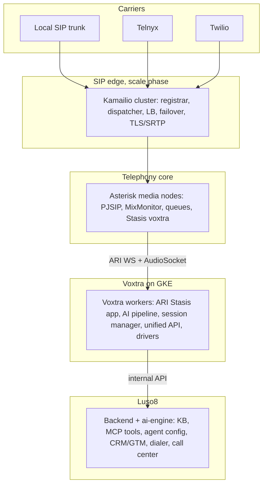

# Luso8 + Voxtra Integration: Architecture and Roadmap

This document describes how three pieces that exist today get assembled into one
voice stack, with Voxtra as the abstraction layer:

- **Voxtra** (this repo): a Python voice-abstraction library with a production
  Asterisk ARI adapter and a full STT, LLM, TTS pipeline.
- **luso8-telephony-core**: a fork of Asterisk deployed as the PBX on GCP.
- **kamailio** (`rexplore-ai/luso8-kamailio`): a fork intended as the SIP edge for
  heavy scale.

It is an architecture and roadmap only. It proposes no code or infra change by
itself. House style: no em-dashes.

---

## 1. Why this document

Luso8 already runs AI, human, and contact-center calls, today primarily on
LiveKit plus Telnyx. The Asterisk PBX, Voxtra, and the Kamailio fork were built
in parallel and are not yet assembled into a single path. The aim is a
telecom-grade foundation where AI agents, human agents, and contact centers all
run through Voxtra over Asterisk (and, at scale, Kamailio), while the existing
LiveKit path keeps working during the migration.

Agreed decisions that shape this plan:

- Deliver the architecture and roadmap first, with no infra or code changes.
- Run the Voxtra worker on GKE.
- Assume a carrier SIP trunk is available to configure.

---

## 2. Current state (verified)

### Asterisk PBX
- VM `luso8-asterisk-pbx`, africa-south1-a, e2-standard-2, external IP
  `34.35.43.82`, status RUNNING.
- Built from `luso8-telephony-core` (standard Asterisk, no C changes) into an
  Artifact Registry image, deployed by a VM startup script.
- Config is templated at container start with `envsubst` from GSM secrets
  `luso8-pbx-*` (see `pull-secrets.sh`). Live reload via `reload-config.sh`.
- Ports: ARI 8088 (user `asterisk`), SIP 5060, RTP 10000-10100.
- Dialplan: inbound `from-carrier` runs `MixMonitor` (record) then
  `Stasis(voxtra)`; outbound `from-voxtra` dials the trunk; agent queues exist;
  recordings sync to GCS every 5 minutes.
- The carrier trunk values (`luso8-pbx-sip-trunk-host`, `-user`, `-pass`,
  `outbound-caller-id`) are still `PLACEHOLDER_SET_FROM_ADMIN_DASHBOARD`, so the
  PBX cannot place real PSTN calls yet.

### Voxtra (this repo)
- Functional, not a scaffold: `VoxtraApp`, `CallSession`, router, events, a
  plugin registry, a production `AsteriskARIAdapter`
  (`telephony/asterisk/adapter.py`), `ari/client.py`, AudioSocket and WebSocket
  media transports, and `core/pipeline.py` (an STT to LLM to TTS loop with
  barge-in: Deepgram, ElevenLabs, OpenAI, energy VAD).
- It is a library, run as an app or worker.
- LiveKit adapter is a stub. Twilio, Telnyx, and Kamailio drivers are not built.

### luso8.backend
- `app/services/voxtra_client.py` wraps `voxtra.ARIClient` for originate,
  hangup, status, and recording over ARI, using dialplan routing (not Stasis).
- `app/api/v1/endpoints/asterisk.py` has the outbound call, the event webhook,
  the recording-ready webhook, and the batch dialer.
- Asterisk config is per-org in the `TelephonyProvider` table.
  `voxtra_bridge_url` and `voxtra_api_key` are reserved for a future external
  Voxtra service.
- The live AI-voice path today is LiveKit plus Telnyx; the Asterisk path is
  wired but parallel.

### Kamailio
- Fork exists; not cloned locally; not integrated.

---

## 3. Target architecture

Voxtra is the unified voice layer. Top to bottom:

Principles:

- **Voxtra fronts both transports.** Asterisk is the live driver. LiveKit,
  Twilio, and Telnyx sit behind the same `BaseTelephonyAdapter`, so the backend
  asks for a call and Voxtra picks the transport. LiveKit and Asterisk coexist
  during migration, so this is not a hard cutover.
- **The Voxtra worker is the missing runtime piece.** The dialplan already hands
  inbound calls to `Stasis(voxtra)`, but no Voxtra worker is connected to that
  ARI app yet (AI voice runs on LiveKit today). Deploying that worker is what
  makes AI voice on Asterisk real.
- **The backend stays the brain.** Voxtra calls into luso8 (knowledge-base
  search, MCP tools, voice-agent config) over the internal API, reusing what the
  LiveKit voice worker already uses.

---

## 4. Integration seams

These are the points where the pieces connect, and what each owns:

1. **Origination.** Backend to Voxtra to Asterisk ARI (today
   `voxtra_client.originate`), or backend to LiveKit. Voxtra unifies both behind
   one request.
2. **Inbound handling.** Asterisk `Stasis(voxtra)` to a Voxtra worker that runs
   the AI pipeline. This is new runtime to deploy.
3. **AI grounding.** Voxtra to the ai-engine/backend internal API for
   voice-agent config, knowledge-base search, and MCP tools (mirror the LiveKit
   worker's `config_loader` and tool path).
4. **Events and lifecycle.** Asterisk and LiveKit events normalize into the
   existing `CallSession` and `CallLog`, and `terminate_call`.
5. **Recording.** Asterisk MixMonitor to GCS (already wired); surfaced through
   the same recording-playback endpoints used by the dialer and call center.
6. **Config.** Per-org `TelephonyProvider` rows plus the `luso8-pbx-*` secrets.

---

## 5. Roadmap

### Phase 1: Asterisk + Voxtra path live (single node, parallel to LiveKit)
- Configure a real carrier trunk: set `luso8-pbx-sip-trunk-host`, `-user`,
  `-pass`, and `outbound-caller-id`, then reload PJSIP (`reload-config.sh`).
  Confirm `pjsip show registrations` is Registered.
- Deploy the Voxtra Stasis worker on GKE, in a cluster or node pool near the PBX
  region (see media locality in Risks). It connects to Asterisk ARI over the
  WebSocket, runs the AI pipeline, and registers the `voxtra` Stasis app. Env
  from a new k8s secret mapped from `luso8-pbx-ari-*` plus the AI keys.
- Wire Voxtra to luso8: a thin adapter so the pipeline pulls agent config, KB
  search, and MCP tools from the internal API.
- Open the network path: ARI 8088 and AudioSocket/RTP between the worker and the
  PBX.
- Verify end to end: inbound (carrier to Asterisk to `Stasis(voxtra)` to AI from
  KB to recording in GCS to a CallLog with disposition) and outbound (backend
  originate to Asterisk to carrier).
- Repos: `voxtra` (worker entrypoint + luso8 adapter), `luso8.backend`
  (provider config and selection), `infrastructure` (k8s + firewall).
  `luso8-telephony-core` already supports the trunk template.

### Phase 2: Unify the backend telephony layer behind Voxtra
- A provider abstraction so the dialer, call center, and campaigns target
  Asterisk or LiveKit through one call path and one normalized event stream into
  `CallSession`/`CallLog` and `terminate_call`.
- Move carrier config into the admin dashboard (it already writes the
  `luso8-pbx-*` secrets, which is why they are placeholders today).
- Promote the batch dialer from a FastAPI BackgroundTask to a Celery queue.
- Repos: `luso8.backend` (telephony unification, `call_orchestration`,
  `asterisk.py` webhooks), `luso8.ai.engine` (`telephony_service`).

### Phase 3: Kamailio SIP edge for scale (telecom-grade)
The fork `rexplore-ai/luso8-kamailio` is currently vanilla upstream: no Luso8 config,
Docker, or CI yet, but every module the edge needs is already in the source
(`dispatcher`, `registrar` plus `usrloc`, `tls`, `rtpengine`, `permissions`,
`topos`, `dialog`, `htable`, `auth_db`). Phase 3 adds the Luso8 layer on top,
mirroring how `luso8-telephony-core` wrapped Asterisk.

- **Role split.** Kamailio is the SIP edge and does stateless signaling: it
  terminates carrier and client SIP, authenticates and rate-limits, hides
  topology, and load-balances INVITEs across the Asterisk media nodes. Asterisk
  keeps media, IVR, queues, recording, and the `Stasis(voxtra)` handoff. Voxtra
  workers run on GKE behind the Asterisk ARI.
- **Modules and their role here.**
  - `dispatcher`: spread calls across N Asterisk nodes with health probes and
    failover.
  - `registrar` plus `usrloc`: SIP registration for agent softphones and clients.
  - `permissions`: allow only known carrier and node IPs (address table).
  - `tls`: TLS for SIP signaling, paired with SRTP via `rtpengine`.
  - `rtpengine`: media relay and NAT traversal (run the rtpengine daemon
    alongside Kamailio).
  - `topos` plus `dialog`: topology hiding and dialog state for clean BYE and
    REFER.
  - `htable` plus `auth_db`: per-tenant routing data and credentials.
- **Build and deploy (mirror the Asterisk fork).** Add a templated
  `etc/kamailio.cfg` whose placeholders are filled at container start from GSM
  via `envsubst`, a Dockerfile, and a CI workflow that builds to Artifact
  Registry and deploys to a GCE VM or a GKE workload. New GSM secrets
  `luso8-kamailio-*`: the dispatcher target list (Asterisk node IPs), the carrier
  IP allowlist, TLS cert references, and the rtpengine address.
- **Routing.** Multi-tenant by DID and SIP domain: an inbound DID maps to a
  tenant context, then dispatches to an Asterisk node; outbound from Asterisk
  egresses through Kamailio to the carrier.
- **When to do it.** Only once concurrency or multi-node HA demands it. The
  single Asterisk node from Phases 1 and 2 serves the earlier stages directly,
  so Kamailio is not on the critical path until scale requires it.
- Repos: `rexplore-ai/luso8-kamailio` (Luso8 config, Docker, CI), `luso8-telephony-core`
  (multi-node), `infrastructure`.

---

## 6. Environment and secret map

The PBX reads these GSM secrets at container start (`pull-secrets.sh` to
`/opt/luso8/.env`, then `envsubst` into the Asterisk config templates):

| Secret | Purpose | Status |
| --- | --- | --- |
| `luso8-pbx-ari-username` | ARI user (`asterisk`) | set |
| `luso8-pbx-ari-password` | ARI password | set |
| `luso8-pbx-external-ip` | PJSIP external media/signaling address | set (34.35.43.82) |
| `luso8-pbx-sip-domain` | SIP domain (`pbx.luso8.rexplore.ai`) | set |
| `luso8-pbx-sip-trunk-host` | carrier SIP host | placeholder |
| `luso8-pbx-sip-trunk-user` | carrier SIP user | placeholder |
| `luso8-pbx-sip-trunk-pass` | carrier SIP password | set |
| `luso8-pbx-outbound-caller-id` | default outbound caller ID | placeholder |
| `luso8-pbx-recordings-bucket` | GCS recordings bucket | set |
| `luso8-livekit-sip-uri` | LiveKit SIP gateway (existing path) | set |

The Voxtra worker on GKE needs: the ARI URL plus `luso8-pbx-ari-username` and
`-password`, the AI keys (`OPENAI_API_KEY`, `DEEPGRAM_API_KEY`,
`ELEVENLABS_API_KEY`), and the internal API key to reach the ai-engine/backend.

Phase 3 adds `luso8-kamailio-*` secrets following the same GSM plus `envsubst`
pattern: the dispatcher target list (Asterisk node IPs), the carrier IP
allowlist, TLS cert references, and the rtpengine address.

---

## 7. Verification (for each phase, when built)

- Phase 1: place a test inbound and a test outbound call through Asterisk;
  confirm `Stasis(voxtra)` handles it, the AI answers grounded in the KB, the
  recording lands in GCS, and a CallLog with a disposition is created.
- Phase 2: switch a dialer or call-center call between Asterisk and LiveKit
  through the unified path; confirm events normalize into the same CallSession.
- Phase 3: load test concurrency through Kamailio and fail over a media node
  without dropping registered trunks.

---

## 8. Risks and notes

- **Media locality (most important).** The PBX is in africa-south1 and the main
  GKE cluster is in us-central1. Real-time RTP and AudioSocket across regions add
  large latency. Run the Voxtra worker in a cluster or node pool in the PBX
  region (africa-south1), or co-locate media. Decide this before Phase 1 build.
- **Carrier trunk** values are placeholders today; PSTN through Asterisk is
  blocked until they are set.
- **ARI 8088** is firewalled to GCP-internal plus the load balancer; the Voxtra
  worker egress must be allowed.
- **Coexistence.** LiveKit and Asterisk run side by side during migration;
  Voxtra abstracts both.
